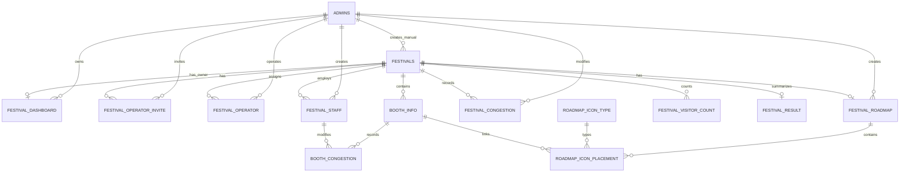

# 관리자 BE 대상 운영자 DB 스키마 구조

## 1. 문서 목적

이 문서는 운영자 DB 생성 SQL 중 `chookjibupAdmin_BE`가 직접 생성·수정·조회하거나 관리자 권한 검증에 사용하는 테이블만 정리한다.

- 기준 SQL: `reference/2026-08/운영자DB_SQl.sql`
- 기준 확인일: 2026-08-02
- 대상 애플리케이션: `chookjibupAdmin_BE`
- 대상 DBMS: PostgreSQL
- 용도: 관리자 BE의 JPA Entity, Repository, Query projection 및 API 수정 기준

## 2. 제외 범위

다음 테이블은 관리자 BE의 JPA 모델 대상에서 제외한다.

| 테이블 | 소유 주체 | 관리자 BE 처리 |
| --- | --- | --- |
| `users` | 사용자 BE | Entity·Repository를 만들지 않음 |
| `festival_wishlist` | 사용자 BE | Entity·Repository를 만들지 않음 |
| `festival_review` | 사용자 BE | 원본 Entity를 만들지 않음. 결과 보고서는 집계 결과만 조회 |
| `festival_visitor_excel` | 데이터 파이프라인 | 적재 Entity를 만들지 않음. 필요한 집계만 Query projection으로 조회 |

관리자 결과 보고서가 리뷰·방문객 데이터를 사용하더라도 관리자 BE가 해당 원본 테이블의 쓰기 소유권을 가져서는 안 된다. 관리자 BE는 `festival_result`, `festival_visitor_count` 또는 별도 집계 Query를 통해 결과만 소비한다.

---

## 3. 관리자 BE 적용 테이블

| 영역 | 테이블 | 관리자 BE 책임 |
| --- | --- | --- |
| 관리자 계정 | `admins` | 가입, 로그인, 계정 상태, 탈퇴 |
| 이메일 인증 | `admin_email_verification` | 사용 여부 결정 필요. 현재는 Redis 사용 |
| 축제 | `festivals` | 수동 축제 등록·수정·조회 |
| 책임 관리자 | `festival_dashboard` | SQL상 축제별 책임 관리자 관계 |
| 운영자 초대 | `festival_operator_invite` | 초대 생성·수락·거절·취소 |
| 운영자 배정 | `festival_operator` | 수락된 제2관리자 배정 관계 |
| 현장 스태프 | `festival_staff` | 계정 생성·조회·삭제·로그인 |
| 로드맵 | `festival_roadmap` | 축제별 현재 캔버스와 배경 이미지 |
| 아이콘 카탈로그 | `roadmap_icon_type` | 배치 가능한 시설 유형 조회·관리 |
| 노드 배치 | `roadmap_icon_placement` | 캔버스 노드 위치·속성 저장 |
| 부스 | `booth_info` | 축제별 부스 등록·수정·조회 |
| 축제 혼잡도 | `festival_congestion` | 관리자 혼잡도 기록 및 대시보드 조회 |
| 부스 혼잡도 | `booth_congestion` | 관리자·현장 스태프 대기시간 기록 |
| 일자별 방문객 | `festival_visitor_count` | 관리자 대시보드·결과 보고서 조회 |
| 축제 결과 | `festival_result` | 관리자 결과 보고서 조회·생성 |

---

## 4. 관리자 중심 관계도



`festival_dashboard`, `festival_roadmap`, `festival_result`는 `festival_id`가 PK이므로 축제당 0개 또는 1개다.

---

## 5. PostgreSQL ENUM

관리자 BE에서 직접 사용하는 enum은 다음과 같다.

| DB enum | 값 | 사용 테이블 |
| --- | --- | --- |
| `festival_source_type` | `api`, `manual` | `festivals` |
| `festival_progress_status` | `upcoming`, `ongoing`, `completed` | `festivals` |
| `invite_status_type` | `pending`, `accepted`, `rejected`, `canceled` | `festival_operator_invite` |
| `roadmap_type` | `uploaded_image`, `icon_builder` | `festival_roadmap` |
| `congestion_level` | `crowded`, `normal`, `comfortable` | 축제·부스 혼잡도, 방문객 수 |
| `modifier_type` | `admin`, `staff` | `booth_congestion` |

DB enum 값은 대부분 소문자이므로 Java enum의 대문자 이름과 단순 `@Enumerated(EnumType.STRING)`으로 바로 호환되지 않는다. 관리자 BE에서 쓰기를 수행하기 전 명시적 PostgreSQL enum 매핑과 통합 테스트가 필요하다.

---

## 6. 관리자 테이블 상세

## 6.1 `admins`

관리자 계정 마스터다.

| 컬럼 | 타입 | Null | 설명 |
| --- | --- | --- | --- |
| `admin_id` | BIGSERIAL | N | PK |
| `email` | VARCHAR(255) | N | UNIQUE |
| `password_hash` | VARCHAR(255) | N | 암호화 비밀번호 |
| `name` | VARCHAR(50) | N | 이름 |
| `birth_date` | DATE | Y | 생년월일 |
| `department` | VARCHAR(100) | Y | 부서 |
| `joined_at` | TIMESTAMPTZ | N | 가입 시각 |
| `is_withdrawn` | BOOLEAN | N | 탈퇴 여부 |
| `withdrawn_at` | TIMESTAMPTZ | Y | 탈퇴 시각 |
| `updated_at` | TIMESTAMPTZ | N | 수정 시각, DB 트리거 갱신 |

현재 관리자 JPA의 `admin_accounts`와 구조가 다르다. UUID, 조직, 직급, 상태를 유지하려면 SQL 보완이 필요하다.

## 6.2 `admin_email_verification`

관리자 이메일 인증 요청을 저장한다.

| 핵심 컬럼 | 설명 |
| --- | --- |
| `verification_id` | PK |
| `email`, `code`, `purpose` | 인증 대상·코드·목적 |
| `created_at`, `expires_at`, `verified_at` | 인증 생명주기 |
| `attempt_count` | 실패 횟수 |

현재 관리자 BE는 Redis TTL을 사용한다. PostgreSQL과 Redis 중 하나를 유효 인증 상태의 원본으로 확정해야 한다.

## 6.3 `festivals`

공공데이터 API 축제와 관리자 수동 축제를 함께 저장하는 공유 마스터다.

관리자 등록에 직접 관련된 컬럼:

| 컬럼 | 설명 |
| --- | --- |
| `festival_id` | 내부 PK |
| `festival_name` | 축제명 |
| `event_place` | 개최 장소 |
| `start_date`, `end_date` | 개최 기간 |
| `content` | 축제 설명 |
| `road_address`, `jibun_address` | 주소 |
| `latitude`, `longitude` | 좌표 |
| `source_type` | API 또는 수동 등록 |
| `created_by_admin_id` | 수동 등록 관리자 FK |
| `progress_status` | 날짜 기준 진행 상태 |
| `updated_at` | 수정 시각 |

CHECK:

```text
manual -> created_by_admin_id 필수
api    -> created_by_admin_id NULL
```

현재 관리자 API의 UUID, 상세주소, 운영시간, 편집 상태, series는 SQL에 없다.

## 6.4 `festival_dashboard`

축제별 책임 관리자 관계다.

| 컬럼 | 설명 |
| --- | --- |
| `festival_id` | PK·축제 FK |
| `admin_id` | 책임 관리자 FK |
| `created_at`, `updated_at` | 생성·수정 시각 |

테이블 이름은 dashboard지만 실제 저장 내용은 책임 관리자 배정이다. 현재 JPA의 `FESTIVAL_OWNER`와 연결할 수 있다.

## 6.5 `festival_operator_invite`

제2관리자 초대 상태를 저장한다.

- 본인 초대 CHECK
- 같은 축제·피초대자의 pending 초대 부분 UNIQUE
- accepted/rejected/canceled 시 응답 시각 관리
- 현재 SQL은 accepted 전환 트리거로 `festival_operator`를 자동 생성

## 6.6 `festival_operator`

수락된 제2관리자와 축제의 N:M 관계다.

- PK: `operator_id`
- UNIQUE: `(admin_id, festival_id)`
- 초대 이력 `invite_id` 참조

관리자 BE에서는 이 행을 `SUB_ADMIN` 역할로 해석한다.

## 6.7 `festival_staff`

현장 스태프 계정이다.

| 컬럼 | 설명 |
| --- | --- |
| `staff_id` | PK |
| `festival_id` | 축제 FK |
| `login_id` | 현재 SQL상 전역 UNIQUE |
| `password_hash`, `name` | 인증·표시 정보 |
| `birth_date`, `phone_number` | 개인 정보 |
| `is_active` | 활성 여부 |
| `created_by_admin_id` | 생성 관리자 FK |
| `created_at` | 생성 시각 |

현재 JPA의 UUID, 축제별 login ID UNIQUE, 유효기간, ACTIVE/DELETED 상태와 병합 검토가 필요하다.

## 6.8 `festival_roadmap`

축제당 현재 로드맵 하나를 저장한다.

| 컬럼 | 설명 |
| --- | --- |
| `festival_id` | PK·축제 FK |
| `roadmap_type` | 이미지 업로드 또는 아이콘 빌더 |
| `base_image_url` | 배경 이미지 위치 |
| `canvas_width`, `canvas_height` | 캔버스 크기 |
| `created_by_admin_id` | 작성 관리자 |
| `created_at`, `updated_at` | 생성·수정 시각 |

S3 원본·표시본·checksum·교체 이력은 현재 SQL에 없다.

## 6.9 `roadmap_icon_type`

배치 가능한 시설 아이콘 카탈로그다.

- `code` UNIQUE
- 이름과 이미지 URL
- 활성 상태
- 관리자 로드맵 편집기의 시설 목록에 사용

## 6.10 `roadmap_icon_placement`

캔버스 위 노드 위치를 저장한다.

현재 저장 가능 값:

- icon type
- 관련 booth
- X/Y
- 회전
- 라벨
- 작성 관리자

현재 관리자 예상 화면에 필요한 width, height, z-index, node type, version은 없다.

## 6.11 `booth_info`

축제별 부스 기본 정보다.

- `booth_id` PK
- `festival_id` FK
- 이름, 설명, 위치
- 생성·수정 시각

관리자 CRUD에서 외부 공개 식별자와 삭제 상태가 필요할지 결정해야 한다.

## 6.12 `festival_congestion`

축제 전체 혼잡도 기록이다.

- 축제 FK
- 수정 관리자 FK
- 혼잡도 enum
- 생성·수정 시각

새 행을 계속 추가하는 이력형인지, 현재 행을 수정하는 상태형인지 SQL만으로 확정되지 않았다.

## 6.13 `booth_congestion`

부스별 대기시간과 혼잡도다.

- 관리자 또는 스태프 중 정확히 한 명만 수정자로 저장하는 CHECK
- 대기시간 0 이상 CHECK
- 부스 삭제 CASCADE
- 수정자 삭제 SET NULL

## 6.14 `festival_visitor_count`

축제·날짜별 방문객 수를 저장한다.

- UNIQUE: `(festival_id, visit_date)`
- 방문객 수 0 이상 CHECK
- 관리자 대시보드와 결과 보고서 조회 대상

## 6.15 `festival_result`

축제당 결과 snapshot 하나를 JSONB로 저장한다.

- `congestion_flow`
- `booth_congestion_summary`
- `review_summary`
- `generated_at`

관리자 BE는 원본 사용자 리뷰 Entity 대신 이 집계 결과를 조회한다.

---

## 7. 시간과 스키마 생성 정책

SQL은 `TIMESTAMPTZ`를 사용한다. 관리자 JPA는 `Instant` 또는 `OffsetDateTime`을 사용하도록 맞추는 것이 안전하다.

현재 운영 DB와 보존 데이터가 없으므로 지금 당장 데이터 이관 migration은 필요하지 않다.

권장 순서:

1. 목표 생성 SQL 확정
2. 빈 PostgreSQL DB 재생성
3. 관리자 JPA 매핑 수정
4. `ddl-auto=validate`로 검증
5. 운영 DB 도입 직전에 Flyway baseline 적용

관리자 BE가 공유 DB를 `ddl-auto=update`로 자동 변경하게 두지 않는다.

---

## 8. 관리자 BE 소유권 원칙

- 사용자 계정, 찜, 리뷰 원본을 관리자 JPA Aggregate로 만들지 않는다.
- 파이프라인 엑셀 원본을 관리자 JPA Aggregate로 만들지 않는다.
- 관리자 BE는 수동 축제와 운영 데이터를 수정한다.
- 공공데이터 API 원본 필드는 파이프라인이 수정한다.
- 리뷰·방문객 원본이 필요하면 집계 Query 또는 결과 snapshot만 사용한다.
- 내부 FK는 BIGINT, 관리자 API 공개 식별자는 UUID 사용 여부를 별도로 확정한다.
